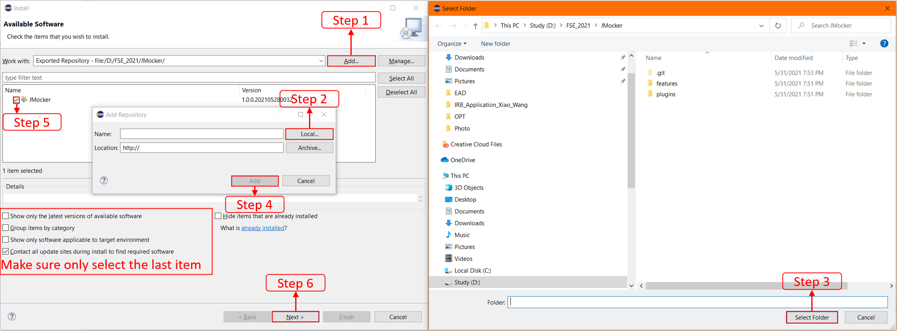
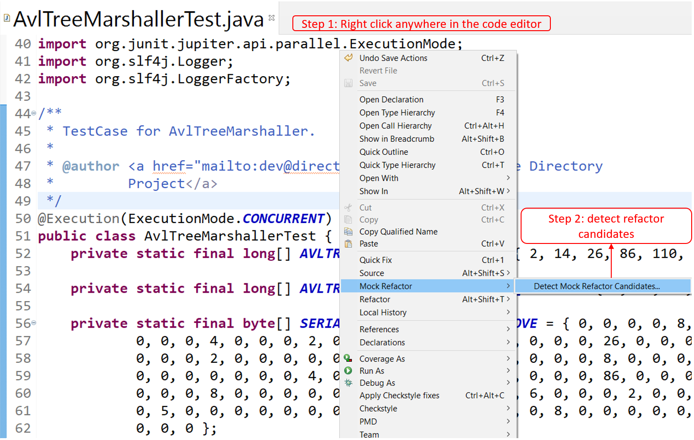
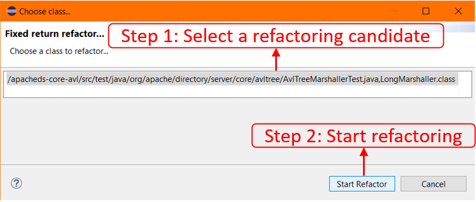

# JMocker
JMocker is an [Eclipse](https://www.eclipse.org/) Plugin to automatically identifies and replaces the usage of test to production inheritance by using [Mockito](https://site.mockito.org/), a well received mocking framework.
## Artifact Description
JMocker can help practitioners to improve the quality of the unit test cases in various aspects, including improving the cohesion/concise, readability/understandability and maintainability of unit test cases.

This artifact links to: [An Automatic Refactoring Framework for Replacing Test-Production Inheritance by Mocking Mechanism, FSE 2021][paper].

## How to use JMocker

### Install JMocker:

1. Download [Eclipse IDE](https://www.eclipse.org/downloads/) and install it.
2. Download [Java JDK](https://www.oracle.com/java/technologies/javase-downloads.html) (JDK 11 or later version).
3. Clone this repository.
4. Install JMocker in Eclipse:
    - Open Eclipse, Click Help -> Install New Software.
    - Click Add.. -> Local... and select the cloned repository.
    - Click Next and finish the installation. 
    
### Use JMocker:

1. Clone a Java project repository. E.g., [JackRabbit](https://github.com/apache/jackrabbit)
2. Import the project into the Eclipse IDE.
3. Add [Mockito dependency](https://mvnrepository.com/artifact/org.mockito/mockito-core/3.9.0) to pom files.
4. Select software entities (Packages or Source Files) and detect refactoring candidates. We use [AuthorizableActionTest.java](https://github.com/apache/jackrabbit/blob/ed3124e5fe223dada33ce6ddf53bc666063c3f2f/jackrabbit-core/src/test/java/org/apache/jackrabbit/core/security/user/AuthorizableActionTest.java) as an example here. 
5. Select a refactoring candidate and start refactor.   
6. **Expected Output:** After refactoring, the test class that inherit the production class is removed and the reference to the test class becomes the reference to a mock object.

[paper]: https://2021.esec-fse.org/details/fse-2021-papers/59/An-Automatic-Refactoring-Framework-for-Replacing-Test-Production-Inheritance-by-Mocki
